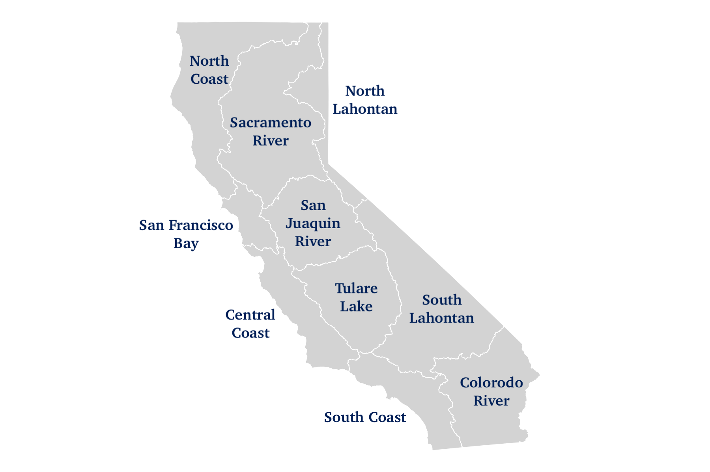
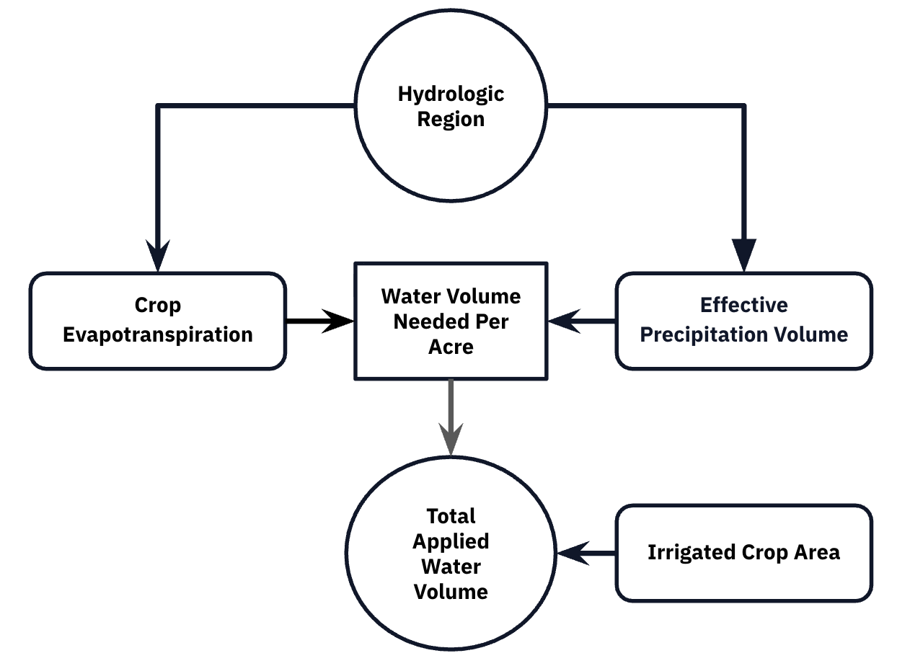

https://github.com/willrmull/Vineyard_Water_Usage


# Introduction

## The California Water Challenge

**Does hydrologic region affect vineyard water use in California, after controlling for evapotranspiration, precipitation, and irrigated crop area?** 

California agriculture accounts for approximately 80% of the state's developed water supply, making efficient water use critical for both economic sustainability and environmental stewardship. With climate change intensifying drought conditions and increasing competition for limited water resources, understanding regional differences in agricultural water use has become essential for policy development and resource allocation.

Vineyards represent a substantial portion of agricultural water consumption, spanning diverse climate zones from California's cool coastal appellations to its hot interior valleys. Annual applied water volumes range from hundreds to over 100,000 acre-feet per hydrologic region—variation that reflects differences in climate, management practices, and efficiency.

(Left Hand Site)

### California Hydrologic Regions

The state is divided into 10 hydrologic regions, each with distinct climate characteristics that influence agricultural water demand.

```{r, eval=TRUE, echo=FALSE}
# Setup
library(tidyverse)
library(here)
library(janitor)
library(readxl)
library(viridis)
library(car)
library(patchwork)
library(broom)
library(stringr)
```

(Right Hand Site)



Data Sources & Structure

Data was extracted from the California Department of Water Resources 
**Statewide Agricultural Water Use Data (2016-2020)** Excel Application Tool. This dataset provides annual estimates 
for water use variables across 20 crop types and multiple geographic scales.

**Key variables used in this analysis:**

- **Regional Applied Water Volume (AW)**: Total irrigation water applied to vineyards in acre-feet
- **Regional Irrigated Crop Area (ICA)**: Total vineyard acreage receiving irrigation
- **Regional Crop Evapotranspiration (ETc)**: Total water lost to atmosphere from soil and plants (acre-feet)—represents crop water demand
- **Regional Effective Precipitation (Ep)**: Rainfall that effectively contributes to crop water needs (acre-feet)
- **Hydrologic Region (HR)**: California's 10 major hydrologic regions, defined by watershed boundaries and climate characteristics

Data availability: [California DWR Water Use Data](https://data.ca.gov/dataset/statewide-agricultural-water-use-data-2016-2020).

### Directed Acyclic Graph (DAG)

The following DAG illustrates the conceptual model of how the variables relate:

1. **Hydrologic Region (HR) → Climate Driven Variables**: HR defines the local climate conditions
   - Different regions have different temperatures, humidity, and weather patterns
   - This drives both ETc (water lost) and Ep (water gained naturally)

2. **Climate Driven Variables → Water Use**: After accounting for natural water supply (Ep), the deficit between demand (ETc) and supply must be met through irrigation

3. **Vineyard Size (ICA) → Total Volume**: Larger vineyards require proportionally more total water (a scaling relationship)

After controlling for climate and size, regional coefficients isolate potential management efficiency differences.
The reference region (Central Coast) represents the efficiency baseline.



### Data Processing Pipeline

The data is stored in an excel application, which means that data for each of the variables is stored on it's own individual sheets. The following code is used to read in data from each of the sheets and convert it into a standard data frame.

```{r}
# ============================================================================
# Read in Data 
# ============================================================================

variables <- c("Regional_AW_Vol", "Regional_ICA", "Regional_ETc_Vol", "Regional_Ep_Vol")

original_names <- c(
  "V1" = "Year", "V2" = "RO", "V3" = "HR", "V4" = "PA", "V5" = "DAU-Co", 
  "V6" = "Grain", "V7" = "Rice", "V8" = "Cotton", "V9" = "Sugar Beet", 
  "V10" = "Corn", "V11" = "Dry Beans", "V12" = "Safflower", 
  "V13" = "Other Field", "V14" = "Alfalfa", "V15" = "Pasture",
  "V16" = "Tomato Processing", "V17" = "Tomato Fresh", "V18" = "Cucurbits", 
  "V19" = "Onion & Garlic", "V20" = "Potatoes", "V21" = "Truck Crops", 
  "V22" = "Almonds & Pistachios", "V23" = "Other Deciduous", 
  "V24" = "Citrus & Subtropical", "V25" = "Vineyard", "V26" = "Total"
)

all_tables <- list()
for (parameter in variables) {
  temporary_sheet <- read_excel(here::here("data", "water_use.xlsx"), 
                                sheet = parameter, 
                                skip = 1) 
  
  # Clean Sheet
  temporary_sheet <- temporary_sheet %>% 
    select_if(~!all(is.na(.))) %>% 
    remove_empty(which = "cols")
  
  # Remove column unique to Regional_ICA (Multi-Crop)
  if(parameter == "Regional_ICA") {
    indices_to_remove <- grep("ulti", names(temporary_sheet))
    temporary_sheet <- temporary_sheet[, -indices_to_remove]
  }
  
  # Create index of year columns and space between year columns
  year_index <- grep("Year", names(temporary_sheet))
  intervals <- c(diff(year_index), ncol(temporary_sheet) - year_index[length(year_index)] + 1)
  
  # Initalize list for storing the blocks from each parameter
  blocks <- list()
  
  for (count in seq_along(year_index)) {
    start <- year_index[count]
    end   <- start + intervals[count] - 1

    block <- temporary_sheet[, start:end, drop = FALSE]
    colnames(block) <- paste0("V", seq_len(ncol(block)))
    
    # Onlu keep rows with four digit number in ythe year column
    block <- block %>%
      filter(grepl("^\\d{4}$", V1))  # Keeps only rows where V1 is exactly a 4-digit year
    
    # Convert all columns to character for safe binding
    block <- block %>%
      mutate(across(everything(), as.character))
    
    blocks[[length(blocks) + 1]] <- block
    blocks[[count]] <- block
  }
  
  df_stacked <- bind_rows(blocks) 
  colnames(df_stacked) <- original_names[colnames(df_stacked)]
  
  pivoted_table <- df_stacked %>%
    pivot_longer(
      cols = !c("Year", "RO", "HR", "PA", "DAU-Co"),
      names_to = "Crop_Type",           # New column for the month names
      values_to = "Value"           # New column for the sales values
    ) %>%
    mutate(
      Parameter = parameter,
      Value = suppressWarnings(as.numeric(Value))
    )
  
  all_tables[[parameter]] <- pivoted_table
}

combined_long <- bind_rows(all_tables)

# Now pivot wider to get each parameter as a column
final_data <- bind_rows(all_tables) %>%
  pivot_wider(
    names_from = Parameter,
    values_from = Value,
    values_fn = mean
  ) %>% 
filter(Crop_Type != "Total", "Regional_AW_Vol" >= 0)
```

### Data Preparation

Now that the data has been read in, we can select data collected from vineyards which applied water to their crops. That gives the folling data frame

```{r}
# Select vineyard data
vineyard_data <- final_data %>%
  filter(Crop_Type == "Vineyard", Regional_AW_Vol > 0, Regional_ICA > 0) %>%
  mutate(
    across(Regional_AW_Vol:Regional_Ep_Vol, ~replace_na(., 0)), # Remove NA Variables
    aw_per_acre = Regional_AW_Vol / Regional_ICA,
    log_aw = log(Regional_AW_Vol)
  )

# Format Hydrologic Region Names
vineyard_data$HR <- gsub("0[0-9]_", "", vineyard_data$HR)
vineyard_data$HR <- gsub("10_", "", vineyard_data$HR)
vineyard_data$HR <- factor(vineyard_data$HR)

# View
head(vineyard_data, 10)
```

## Data Exploration

### Regional Water Use Summary
```{r}
# Get Summary AW Data For Each Region
regional_summary <- vineyard_data %>%
  group_by(HR) %>%
  summarise(
    n = n(),
    mean_AW = mean(Regional_AW_Vol),
    median_AW = median(Regional_AW_Vol),
    sd_AW = sd(Regional_AW_Vol),
    se_AW = sd_AW / sqrt(n)) %>%
  arrange(mean_AW)

regional_summary
```

**Key observations:**

- **Large variation between regions**: Mean water use ranges from 129 acre-feet (South Lahontan) to 38,072 acre-feet (Tulare Lake)—a nearly 300-fold difference
- **High within-region variability**: Standard deviations exceed means in all regions, indicating right-skewed distributions
- **Median < Mean everywhere**: Consistent with right skew caused by a few very large vineyard operations

### Distribution of Water Use

This log-scale boxplot reveals that while most regions have modest median use (100-1,000 acre-feet), there are many high water volume outliers in regions like Central Coast, San Joaquin River, and Tulare Lake—drives
```{r}
vineyard_data %>%
  ggplot(aes(x = reorder(HR, Regional_AW_Vol, FUN = median),
             y = Regional_AW_Vol)) +
  geom_boxplot(aes(fill = HR), outlier.alpha = 0.3) +
  scale_fill_viridis_d() +
  scale_y_log10(labels = scales::comma) +
  labs(
    x = "Hydrologic Region",
    y = "Applied Water Volume (Acre-Feet, Log Scale)",
    title = "Applied Water Volume Distribution Across California Regions",
    subtitle = "Regions ordered by median water use"
  ) +
  theme(
    axis.text.x = element_text(angle = 45, hjust = 1),
    legend.position = "none",
    plot.title = element_text(hjust = 0.5, face = "bold"),
    plot.subtitle = element_text(hjust = 0.5)
  )
```
# Statistical Model

## Model Specification

### Why Gamma?

The Gamma distribution is appropriate here because:

1. **Positive support**: Water use cannot be zero or negative in irrigated areas
2. **Right-skewed**: The distribution has a long right tail (high outliers)
3. **Mean-variance relationship**: Variance increases with the mean (heteroscedasticity)

### Model Statistical Notation

$$
Y_i \sim \text{Gamma}(\text{shape} = k, \text{scale} = \theta_i)
$$

where:
- $Y_i$ = Regional Applied Water Volume for observation $i$
- $k = 1/\phi$ is the shape parameter (constant across observations)
- $\phi$ is the dispersion parameter
- $\theta_i$ is the scale parameter (varies by observation)

**Gamma Regression Equation:**
$$
log(μ) = β_0 + β_1ETc_i + β_2Ep_i + β_3log(ICA_i) + β_4HR_4 + β_5HR_6 + β_5HR_6 + ... + β_kHR_k
$$

Coefficient Interpretation:

- $β_1, β_2E$: Multiplicative change in water use per unit increase in ETc or Ep
- $β_3log(ICA_i)$: Change in water use per % change in vineyard area
- $β_4 - β_11$: Regional multiplier relative to Central Coast (reference region)


### Model Fitting

```{r}
set.seed(123)

gamma_model <- glm(Regional_AW_Vol ~
                        Regional_ETc_Vol + 
                        Regional_Ep_Vol + 
                        log(Regional_ICA) + 
                        HR, 
                     family = Gamma(link = "log"),
                     data = vineyard_data)


summary(gamma_model)
```


## Model Validation Through Simulation

To ensure the model is correctly specified and is able to reliably estimate parameters, simulations are used. This  process involves:

1. Using coefficients from the model as the "true" values
2. Generating 500 synthetic datasets using those parameters
3. Refitting the model for each dataset
4. Checking if that model recovers the true parameters

### Simulation Procedure

```{r}
# Extract true parameters
true_coefs <- coef(gamma_model)
true_dispersion <- summary(gamma_model)$dispersion

# Function to simulate data
simulate_vineyard_data <- function(predictors, betas, dispersion, n_sim = 1) {
  # Design matrix
   X <- model.matrix(~ Regional_ETc_Vol + Regional_Ep_Vol + 
                      log(Regional_ICA) + HR, data = predictors)
   
  #  Linear predictor (log scale)
  eta <- X %*% betas
   
  # Mean (inverse link)
  mean <- exp(eta)
  
  # Gamma shape parameter 
  shape <- 1 / dispersion
  
  # Simulate response
  y_sim <- rgamma(nrow(predictors), shape = shape, scale = mean / shape)
  
  return(y_sim)
}
```

```{r}
# Run simulations

# Number of simulations
n_sims <- 500 
results <- vector("list", n_sims)

# Run simulations
for (i in 1:n_sims) {
  # Simulate new response
  vineyard_sim <- vineyard_data
  vineyard_sim$Regional_AW_Vol <- simulate_vineyard_data(
    vineyard_data, true_coefs, true_dispersion
  )
  
  # Refit model
  model_sim <- glm(
    Regional_AW_Vol ~ Regional_ETc_Vol + Regional_Ep_Vol + 
    log(Regional_ICA) + HR,
    family = Gamma(link = "log"),
    data = vineyard_sim
  )
  
  # Store results
  results[[i]] <- list(
    coefs = coef(model_sim),
    converged = model_sim$converged
  )
}

# Extract coefficient matrix
coef_matrix <- do.call(rbind, lapply(results, function(x) x$coefs))
```

### Simulation Results

```{r}
param_summary <- data.frame(
  Parameter = names(true_coefs),
  True_Value = true_coefs,
  Mean_Estimate = colMeans(coef_matrix),
  SD = apply(coef_matrix, 2, sd),
  CI_Lower = apply(coef_matrix, 2, quantile, 0.025),
  CI_Upper = apply(coef_matrix, 2, quantile, 0.975),
  row.names = NULL
)

# Check if 95% CI contains true value
param_summary <- param_summary %>% mutate(Contain_95 = if_else(
  True_Value >= CI_Lower & True_Value <= CI_Upper, "Yes", "No"
  ))


print(param_summary)
```

**Interpretation**: For all of the parameters the model was able to recover the true value of the mean within it's 95% confidence interval. This suggest that the model is successfully able to recover the parameter values.

### Visualization of Parameter Recovery


# Statistical Inference

## Hypothesis Testing

### Overall Test: Do Regions Differ?

**Null Hypothesis ($H_0$):**
$$
\beta_4 = \beta_5 = \cdots = \beta_{11} = 0
$$

All HR coefficients are zero, meaning there are NO differences in water use between hydrologic regions after controlling for climate factors and vineyard size.

**Alternative Hypothesis ($H_1$):**
$$
\text{At least one } \beta_i ≠ 0
$$

At least one region differs in water use, indicating that regional factors beyond climate (e.g., efficiency, technology, regulations) affect water use.

### Likelihood Ratio Test

The $H_0$ is tested by comparing the full gamma model (with HR) to a reduced gamma model (without HR):

```{r}
model_null <- glm(
  Regional_AW_Vol ~ Regional_ETc_Vol + Regional_Ep_Vol + log(Regional_ICA),
  family = Gamma(link = "log"),
  data = vineyard_data
)

lrt <- anova(model_null, gamma_model, test = "LRT")
print(lrt)

round(lrt$Deviance[2], 2)
```
**Results:**

- **Test Statistic**: $\chi^2$ = 39.57 (df = 8)
- **P-value**: < 2.2e-16
- **Conclusion**: We **reject the null hypothesis**. There is  evidence that the hydrologic regions affect the water applied by vineyards even after controlling for climate demand, precipitation, and vineyard size.

### Individual Region Comparisons

```{r}
# Extract regional coefficients
regional_effects <- tidy(gamma_model, conf.int = TRUE) %>%
  filter(grepl("^HR", term)) %>%
  mutate(
    Region = gsub("^HR", "", term),
    pct_change = (exp(estimate) - 1) * 100,
    ci_low = (exp(conf.low) - 1) * 100,
    ci_high = (exp(conf.high) - 1) * 100,
    signif = p.value < 0.05
  ) %>%
  arrange(desc(pct_change))

# Add reference region
reference_region <- levels(vineyard_data$HR)[1]
regional_effects <- regional_effects %>%
  add_row(
    Region = reference_region,
    pct_change = 0,
    ci_low = 0,
    ci_high = 0,
    signif = NA,
    .before = 1
  )

# Display table
regional_effects %>%
  select(Region, pct_change, ci_low, ci_high, signif)
```
### Visualizing Regional Coefficients

```{r}
ggplot(regional_effects, aes(x = reorder(Region, pct_change), 
                            y = pct_change)) +
  geom_col(aes(fill = pct_change), width = 0.7) +
  geom_errorbar(aes(ymin = ci_low, ymax = ci_high), 
                width = 0.2, linewidth = 0.8) +
  geom_hline(yintercept = 0, linetype = "solid", linewidth = 0.5) +
  scale_fill_viridis_c(
    name = "% Difference in\nExpected Water Use"
  ) +
  coord_flip() +
  labs(
    title = "Regional Water Use Coefficients",
    subtitle = "Percent difference in expected water use compared to Central Coast (reference region)",
    x = "Hydrologic Region",
    y = "% Difference in Expected Water Use\n(controlling for climate, precipitation, and vineyard size)",
    caption = "Error bars show 95% confidence intervals"
  ) +
  theme(
    plot.title = element_text(hjust = 0.5, face = "bold", size = 14),
    plot.subtitle = element_text(hjust = 0.5, size = 11),
    legend.position = "none"
  )
```
### Interpretation of Regional Coefficients

Of the nine regions, only one, the North Coast, did not differ a statistically significant amount from the coefficient of the central coast. Add more here

## Model Fit and Diagnostics

### Predicted vs Observed Values

```{r}
# Get predictions
vineyard_data$predicted <- predict(gamma_model, type = "response")
vineyard_data$residuals <- residuals(gamma_model, type = "pearson")

# Calculate R-squared
r_squared <- cor(vineyard_data$Regional_AW_Vol, vineyard_data$predicted)^2

# Predicted vs actual plot
ggplot(vineyard_data, aes(x = Regional_AW_Vol, y = predicted)) +
  geom_point(aes(color = HR), alpha = 0.5) +
  geom_abline(slope = 1, intercept = 0, 
              color = "black", linetype = "dashed", linewidth = 1) +
  scale_x_log10(labels = scales::comma) +
  scale_y_log10(labels = scales::comma) +
  scale_color_viridis_d() +
  annotate("text", 
           x = min(vineyard_data$Regional_AW_Vol) * 2, 
           y = max(vineyard_data$predicted) * 0.8,
           label = paste0("R² = ", round(r_squared, 3)),
           hjust = 0, size = 5, fontface = "bold") +
  labs(
    title = "Model Performance: Predicted vs Observed Water Use",
    x = "Observed Applied Water (Acre-Feet, Log Scale)",
    y = "Predicted Applied Water (Acre-Feet, Log Scale)",
    color = "Hydrologic\nRegion"
  ) +
  theme(legend.position = "right")
```
The model explains 98.6% of variance in water use, indicating excellent fit.

# Discussion

## Key Findings

This analysis provides evidence that **hydrologic regions in California differ substantially in vineyard water use efficiency**
even after accounting for climate-driven water demand, effective precipitation, and vineyard size.

### Main Results:

1. **Regional effects are statistically significant and large**
   - LRT test: χ² = 39.6, p < 0.001
   - Coefficients ranged from from -1% to +92% percent different from reference level
   
2. **Three regions show substantially higher coefficients**
   - Colorado River: 92% higher expected water use
   - Tulare Lake: 72% higher expected water use
   - South Lahontan: 74% higher expected water use
   
3. **Model validation confirms reliability**
   - Simulation showed parameter recovery
   - High R² (0.986) the majority of variation can be explained by the model


## Future Directions

Further investigation should be done into finding what is causing the regional variation in water use between the regions. The results of this investigation imply that additional variables
outside of water need are affecting some of these regions. Investigations should look into wether this is causeed by management decsions or by additional evironmental factors not considered in this study.