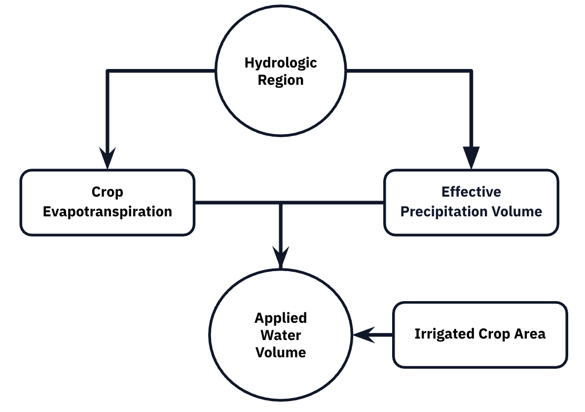

# Title

### Author: William Mullins

### Date: December 5, 2025

------------------------------------------------------------------------

# Regional Water Use Efficiency in California Vineyards

Author: William Mullins Github: https://github.com/willrmull/Vineyard_Water_Usage

(Put this on the left hand side)

California agricultural water use accounts for approximately 80% of the state's developed water supply, with vineyards representing a significant portion of this usage. Thus, as increasing climate pressures begin to materialize it is important that we understand the regional differences in water use for sustainable resource management. This analysis examines the difference in applied water use across the hydrologic regions in California where vineyards are grown, controlling for climate factors, irrigation efficiency, and vineyard size to identify regions with superior water management practices. 

(Put this on the right hand side)


## About the Data

The data used was collects from the California Department of Water Resources Excel Application Tool 
for **Statewide Agricultural Water Use Data from 2016 - 2020**. The data contains estimates for water use variables for twenty crop variables across the state. The variables used in this analysis are applied water (AW), irrigated crop area (ICA), crop evapotranspiration (${ET_c}$), and effective precipitation (Ep) which were analysed at the hydrologic region level. The data and supporting metadata can be accessed
[here](https://data.ca.gov/dataset/statewide-agricultural-water-use-data-2016-2020).

This Directed Acyclic Graph (DAG) illustrates the simplified relationships between the variables. 
1. Hydrologic Region sits at the top as the primary driver of climate-influenced variables:
- **Crop Evapotranspiration** (${ET_c}$):The total water lost to the atmosphere from soil and plant surfaces.
- **Effective Precipitation Volume**: he portion of rainfall that effectively contributes to meeting crop water needs.

2. Applied Water Volume (per acre): The "Applied Water Volume" for a single acre is determined in part by the difference between a crops water demand, ${ET_c}$, and the supply from effective precipitation—i.e., the deficit that must be supplied through irrigation.

3.Irrigated Crop Area acts as a scaling factor: total applied water volume is obtained by multiplying the per-acre applied water by the number of irrigated acres.

{ET_c}



### Import Packages

The analysis requires the following packages
```{r, message = FALSE}
library(tidyverse)
library(here)
library(janitor)
library(readxl)
library(viridis)
library(car)
library(patchwork)
library(broom)
library(stringr)
```

### Read in Data

```{r, messgae = FALSE, echo = FALSE}
# ============================================================================
# Read in Data 
# ============================================================================

variables <- c("Regional_AW_Vol", "Regional_ICA", "Regional_ETc_Vol", "Regional_Ep_Vol")

original_names <- c(
  "V1" = "Year", "V2" = "RO", "V3" = "HR", "V4" = "PA", "V5" = "DAU-Co", 
  "V6" = "Grain", "V7" = "Rice", "V8" = "Cotton", "V9" = "Sugar Beet", 
  "V10" = "Corn", "V11" = "Dry Beans", "V12" = "Safflower", 
  "V13" = "Other Field", "V14" = "Alfalfa", "V15" = "Pasture",
  "V16" = "Tomato Processing", "V17" = "Tomato Fresh", "V18" = "Cucurbits", 
  "V19" = "Onion & Garlic", "V20" = "Potatoes", "V21" = "Truck Crops", 
  "V22" = "Almonds & Pistachios", "V23" = "Other Deciduous", 
  "V24" = "Citrus & Subtropical", "V25" = "Vineyard", "V26" = "Total"
)

all_tables <- list()
for (parameter in variables) {
  temporary_sheet <- read_excel(here::here("data", "water_use.xlsx"), 
                                sheet = parameter, 
                                skip = 1) 
  
  # Clean Sheet
  temporary_sheet <- temporary_sheet %>% 
    select_if(~!all(is.na(.))) %>% 
    remove_empty(which = "cols")
  
  # Remove column unique to Regional_ICA (Multi-Crop)
  if(parameter == "Regional_ICA") {
    indices_to_remove <- grep("ulti", names(temporary_sheet))
    temporary_sheet <- temporary_sheet[, -indices_to_remove]
  }
  
  # Create index of year columns and space between year columns
  year_index <- grep("Year", names(temporary_sheet))
  intervals <- c(diff(year_index), ncol(temporary_sheet) - year_index[length(year_index)] + 1)
  
  # Initalize list for storing the blocks from each parameter
  blocks <- list()
  
  for (count in seq_along(year_index)) {
    start <- year_index[count]
    end   <- start + intervals[count] - 1

    block <- temporary_sheet[, start:end, drop = FALSE]
    colnames(block) <- paste0("V", seq_len(ncol(block)))
    
    # Onlu keep rows with four digit number in ythe year column
    block <- block %>%
      filter(grepl("^\\d{4}$", V1))  # Keeps only rows where V1 is exactly a 4-digit year
    
    # Convert all columns to character for safe binding
    block <- block %>%
      mutate(across(everything(), as.character))
    
    blocks[[length(blocks) + 1]] <- block
    blocks[[count]] <- block
  }
  
  df_stacked <- bind_rows(blocks) 
  colnames(df_stacked) <- original_names[colnames(df_stacked)]
  
  pivoted_table <- df_stacked %>%
    pivot_longer(
      cols = !c("Year", "RO", "HR", "PA", "DAU-Co"),
      names_to = "Crop_Type",           # New column for the month names
      values_to = "Value"           # New column for the sales values
    ) %>%
    mutate(
      Parameter = parameter,
      Value = suppressWarnings(as.numeric(Value))
    )
  
  all_tables[[parameter]] <- pivoted_table
}

combined_long <- bind_rows(all_tables)

# Now pivot wider to get each parameter as a column
final_data <- bind_rows(all_tables) %>%
  pivot_wider(
    names_from = Parameter,
    values_from = Value,
    values_fn = mean
  ) %>% 
filter(Crop_Type != "Total", "Regional_AW_Vol" >= 0)
```

### Data Preperation
```{r}
# Select vineyard data
vineyard_data <- final_data %>%
  filter(Crop_Type == "Vineyard", Regional_AW_Vol > 0, Regional_ICA > 0) %>%
  mutate(
    across(Regional_AW_Vol:Regional_Ep_Vol, ~replace_na(., 0)), # Remove NA Variables
    aw_per_acre = Regional_AW_Vol / Regional_ICA,
    log_aw = log(Regional_AW_Vol)
  )

# Format Hydrologic Region Names
vineyard_data$HR <- gsub("0[0-9]_", "", vineyard_data$HR)
vineyard_data$HR <- gsub("10_", "", vineyard_data$HR)
vineyard_data$HR <- factor(vineyard_data$HR)

# View
head(vineyard_data)
```

### Explore Data 

Now that the data is clean we can gather summary statistics regarding the average annual water use across hydrologic regions which can be seen in the table below.

```{r}
# Get Summary AW Data For Each Region
regional_summary <- vineyard_data %>%
  group_by(HR) %>%
  summarise(
    n = n(),
    mean_AW = mean(Regional_AW_Vol),
    median_AW = median(Regional_AW_Vol),
    sd_AW = sd(Regional_AW_Vol),
    se_AW = sd_AW / sqrt(n)) %>%
  arrange(mean_AW)
```

<table>
  <thead>
    <tr>
      <th colspan="6">Applied Water (AW)</th>
    </tr>
    <tr>
      <th>HR</th>
      <th>n</th>
      <th>mean_AW</th>
      <th>median_AW</th>
      <th>sd_AW</th>
      <th>se_AW</th>
    </tr>
  </thead>
  <tbody>
    <tr>
      <td>South Lahontan</td>
      <td>23</td>
      <td>128.7751</td>
      <td>39.4338</td>
      <td>295.2821</td>
      <td>61.57058</td>
    </tr>
    <tr>
      <td>South Coast</td>
      <td>46</td>
      <td>1287.7218</td>
      <td>296.4866</td>
      <td>2120.1648</td>
      <td>312.60125</td>
    </tr>
    <tr>
      <td>Sacramento River</td>
      <td>206</td>
      <td>3631.8338</td>
      <td>134.9146</td>
      <td>8249.1706</td>
      <td>574.74695</td>
    </tr>
    <tr>
      <td>North Coast</td>
      <td>121</td>
      <td>5936.5745</td>
      <td>443.8500</td>
      <td>10137.3432</td>
      <td>921.57665</td>
    </tr>
    <tr>
      <td>Colorado River</td>
      <td>25</td>
      <td>6748.8049</td>
      <td>386.1504</td>
      <td>13446.1262</td>
      <td>2689.22525</td>
    </tr>
    <tr>
      <td>Central Coast</td>
      <td>163</td>
      <td>9917.9353</td>
      <td>1476.9536</td>
      <td>22978.5316</td>
      <td>1799.81750</td>
    </tr>
    <tr>
      <td>San Francisco Bay</td>
      <td>80</td>
      <td>10135.7991</td>
      <td>138.5488</td>
      <td>25803.3874</td>
      <td>2884.90641</td>
    </tr>
    <tr>
      <td>San Joaquin River</td>
      <td>182</td>
      <td>17764.8654</td>
      <td>3262.9932</td>
      <td>41878.1881</td>
      <td>3104.21783</td>
    </tr>
    <tr>
      <td>Tulare Lake</td>
      <td>166</td>
      <td>38072.2354</td>
      <td>5663.5100</td>
      <td>58246.3556</td>
      <td>4520.79395</td>
    </tr>
  </tbody>
</table>

#### **Takeaways:** 

- Mean AW Between Regions: significant variation in mean AW between regions, with it ranging from ~129 (South Lahontan) to ~38,072 (Tulare Lake).
- Variability Within Regions: In all of the regions the standard deviations exceeded the means, which indicates that there may be skewed distributions cause by high use vineyards
- Median < Mean: In all of the regions the median value was lower, often considerably so, than the mean indicating that there may be a right skew to the data. 

This boxplot,  which displays applied water volume on a log scale, helps visualize the significant variation within regions. It shows that most regions have modest median use, but a few (notably Central Coast and San Joaquin River) show extreme spread: from <10 to >100,000 acre-feet — driven by high-use outliers.
```{r}
# Box-plot of Regional_AW_Vol
vineyard_data %>% 
  ggplot(aes(x = reorder(HR, Regional_AW_Vol, FUN = median),  # Order Data By Median
             y = Regional_AW_Vol)) +
  geom_boxplot(aes(fill = HR), outlier.alpha = 0.3) +
  scale_fill_viridis_d() +
  scale_y_log10(labels = scales::comma) + # Apply log scale
  labs(
    x = "Hydrologic Region", 
    y = "Applied Water Volume (Acre-Feet, Log Scale)",
    title = "Applied Water Volume in Vineyards Across California Regions",
    subtitle = "Ordered By Median Water Use"
  ) +
  theme_minimal(base_size = 12) +
  theme(
    axis.text.x = element_text(angle = 45, hjust = 1),
    legend.position = "none",
    plot.title = element_text(hjust = 0.5, face = "bold"),
    plot.subtitle = element_text(hjust = 0.5)
  )
```

### Gamma Model

For this analysis a gamma model will be used, which shows the. 

Applied Water Volume ~ Gamma(μ, φ) 

log(μ) = β0 + β1*ETc Volume + β2*Ep Volume + β3*log(ICA) + β4*HR

The Gamma GLM with log link was used for the following reasons:
  - Positive Values Only:  The water use can never be zero or negative in areas which are irrigated
  - Right Skewed: As mentioned previously the data shows an extreme positive skews in water use

```{r}
model_gamma <- glm(
  Regional_AW_Vol ~ 
    Regional_ETc_Vol + 
    Regional_Ep_Vol + 
    log(Regional_ICA) +
    HR,
  family = Gamma(link = "log"),
  data = vineyard_data
)

summary(model_gamma)
```

### Hypothesis Test: No Regional Differences

**Null hypothesis**: No difference in water use between regions (all HR coefficients = 0)
**Alternative hypothesis**: Water use varies in at least one of the regions.

In order to test this null hypothesis a new gamma model must be fit without HR.

```{r}
# Null model (without HR)
model_null <- glm(
  Regional_AW_Vol ~ 
    Regional_ETc_Vol + 
    Regional_Ep_Vol + 
    log(Regional_ICA),
  family = Gamma(link = "log"),
  data = vineyard_data
)

lrt <- anova(model_null, model_gamma, test = "LRT")
print(lrt)

print(paste("Chi-square statistic:", lrt$Deviance[2]))
print(paste("Degrees of freedom:", lrt$Df[2]))
print(paste("P-value:", lrt$`Pr(>Chi)`[2]))

```
### Interpretation of Model Results

Chi-square statistic: 39.5658
Degrees of freedom: 8
P-value: < 0.001 (1.67 × 10⁻²⁴⁰)

We reject the null hypothesis. There are statistically significant differences in applied water volume (Regional_AW_Vol) between hydrologic regions (HR), even after controlling for:
- Crop water demand (Regional_ETc_Vol)
- Natural water supply (Regional_Ep_Vol)
- Vineyard size (log(Regional_ICA)).

TYPE III ANOVA: INDIVIDUAL PREDICTOR SIGNIFICANCE
```{r}
anova_results <- Anova(model_gamma, type = "III", test.statistic = "Wald")
print(anova_results)
```
### Parameter Signifigance 

Hydrologic Region 
- Strongest regional effect (χ² = 1,630.2, p < 0.001).
- Interpretation: Regional policies, infrastructure, soil types, or unmeasured climatic factors significantly drive water use differences beyond climate and vineyard size.

Vineyard Size (log(Regional_ICA))
- Extremely significant (χ² = 208,500, p < 0.001).

Climate Drivers
- Crop ET (Regional_ETc_Vol): Significant (p = 0.0013). Higher water demand → more applied water.
- Effective Precip (Regional_Ep_Vol): Significant (p = 0.0063). Natural rainfall offsets irrigation needs.

Intercept
- Baseline water use (when all predictors = 0) is non-zero (p < 0.001), reflecting fixed irrigation requirements.

### Parameter Simulation
```{r}
# Get coefficient values and dispersion from gamma model
true_params <- coef(model_gamma)
true_dispersion <- summary(model_gamma)$dispersion

# function that generates synthetic data
simulate_vineyard_data <- function(n_obs = 200) {
  
  # Samples 1,000 observations with replacement from your original dataset
  sim_data <- vineyard_data %>%
    sample_n(n_obs, replace = TRUE) %>%
    select(Regional_ETc_Vol, Regional_Ep_Vol, Regional_ICA, HR)
  
  # Calculate Expected Values
  X <- model.matrix(~ Regional_ETc_Vol + Regional_Ep_Vol + 
                     log(Regional_ICA) + HR, data = sim_data)
  # Calculates the linear predictor
  eta <- X %*% true_params
  # inverse log link function to get expected water use values
  mu <- exp(eta)
  
  # Simulate Response Variables
  shape_param <- 1 / true_dispersion
  sim_data$Regional_AW_Vol <- rgamma(
    n_obs,
    shape = shape_param,
    scale = as.vector(mu) * true_dispersion
  )
  
  return(sim_data)
}

# Run simulation
set.seed(123)
vineyard_sim <- simulate_vineyard_data(n_obs = 200)

# Refit model to simulated data
validation_model <- glm(
  Regional_AW_Vol ~ Regional_ETc_Vol + Regional_Ep_Vol + 
    log(Regional_ICA) + HR,
  family = Gamma(link = "log"),
  data = vineyard_sim
)
```


```{r}
# Compare parameters from gamma model and validation model
param_comparison <- data.frame(
  Parameter = names(true_params),
  True = true_params,
  Recovered = coef(validation_model),
  Difference = true_params - coef(validation_model),
  Pct_Error = abs((true_params - coef(validation_model)) / true_params * 100)
)

print(param_comparison)

print(paste("Mean absolute % error:", round(mean(param_comparison$Pct_Error, na.rm = TRUE), 2)))
print(paste("Max absolute % error:", round(max(param_comparison$Pct_Error, na.rm = TRUE), 2)))

```

Parameter Recovery Summary:
- Mean absolute % error: 80.03 %
- Max absolute % error: 448.47 %

### Visualization of Model Fit
```{r}
# Get predictions
predicted <- predict(model_gamma, type = "response")
r_squared <- cor(comparison$Actual, comparison$Predicted)^2


# Predicted vs Actual
predicted_plot <- ggplot(comparison, aes(x = Actual, y = Predicted)) +
  geom_point(alpha = 0.5) +
  geom_abline(slope = 1, intercept = 0, color = "blue", 
              linetype = "dashed", linewidth = 1) +
  scale_x_log10(labels = scales::comma) +
  scale_y_log10(labels = scales::comma) +
  scale_color_viridis_d() +
  annotate("text", x = min(comparison$Actual), y = max(comparison$Predicted), 
           label = paste0("R² = ", round(r_squared, 3)),
           hjust = 0, vjust = 1, size = 5, fontface = "bold") +
  labs(
    title = "Model Performance: Predicted vs Actual",
    x = "Actual AW (Acre-Feet)",
    y = "Predicted AW (Acre-Feet)"
  ) +
  theme_minimal(base_size = 11) +
  theme(
    plot.title = element_text(hjust = 0.5, face = "bold"),
    legend.position = "right"
  )

# Residuals by region
residutal_plot <- ggplot(comparison, aes(x = HR, y = Residual)) +
  geom_boxplot(aes(fill = HR), outlier.alpha = 0.3) +
  geom_hline(yintercept = 0, linetype = "dashed", color = "blue") +
  scale_fill_viridis_d() +
  labs(
    title = "Model Residuals by Region",
    x = "Hydrologic Region",
    y = "Residuals (Acre-Feet)"
  ) +
  theme_minimal(base_size = 11) +
  theme(
    axis.text.x = element_text(angle = 45, hjust = 1),
    legend.position = "none",
    plot.title = element_text(hjust = 0.5, face = "bold")
  )

print(predicted_plot / residutal_plot)
```
Discussion 

### Regional Differences in Water Use Efficiency

Add explaination

```{r}
# Extract regional coefficients
regional_coefs <- tidy(model_gamma, conf.int = TRUE) %>%
  filter(str_starts(term, "HR")) %>%
  # Converts log-scale estimates to percentage differences in water use
  mutate(
    region = str_remove(term, "^HR"),
    pct_more_water = (exp(estimate) - 1) * 100,
    ci_low_pct = (exp(conf.low) - 1) * 100,
    ci_high_pct = (exp(conf.high) - 1) * 100
  ) %>%
  # Sets values from reference region (Central Coast) to zero
  bind_rows(
    tibble(
      term = "HR(Reference)",
      estimate = 0,
      std.error = 0,
      statistic = 0, 
      p.value = NA,
      conf.low = 0,
      conf.high = 0,
      region = levels(vineyard_data$HR)[1],
      pct_more_water = 0,
      ci_low_pct = 0,
      ci_high_pct = 0
    )
  ) %>%
  arrange(desc(estimate))  # Fixed ranking direction

# Visualize
plot_rank <- ggplot(regional_coefs,  aes(x = reorder(region, estimate), y = pct_more_water)) +
  geom_col(aes(fill = pct_more_water), width = 0.7) +
  geom_errorbar(aes(ymin = ci_low_pct, ymax = ci_high_pct), width = 0.2) +
  geom_hline(yintercept = 0) +
   scale_fill_viridis_c(
    direction = 1,     
    name = "% More\nWater",
    limits = c(min(regional_coefs$ci_low_pct), max(regional_coefs$ci_high_pct))
  ) +
  coord_flip(clip = "off") +
  labs(
    title = "Regional Water Use Efficiency Rankings",
    subtitle = "% More Water Used Compared to Central Coast",
    x = "Hydrologic Region",
    y = "% More Water Used (controlling for climate and size)",
    caption = "Error bars show 95% confidence intervals"
  ) +
  theme_minimal() +
  theme(
    plot.title = element_text(hjust = 0.5, face = "bold", size = 14),
    plot.subtitle = element_text(hjust = 0.5),
    legend.position = "right",
    plot.margin = margin(r = 20)  # Extra space for rank numbers
  )

print(plot_rank)
```
Add Stats Later

Discussion:


